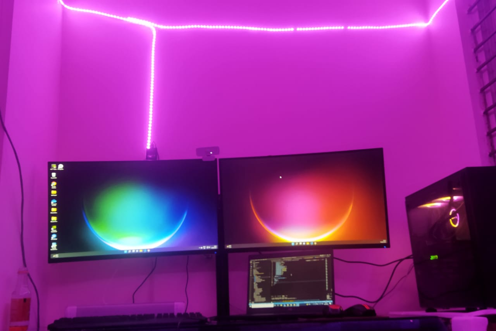

  

 

  
  
  
  
  

<h1 align="center">Hi 
,
  I am Hari Sankar Nayak 
</h1>
<h3 align="center">Machine Learning | Data Scientist Enthu | Software Engineer </h3>

  
  
  
  

  <em>
    Hello, I am Hari Sankar Nayak a <b>Software Engineer</b>.  
    <b>a passionate self-learner</b>  and a
    <b>Machine Learning Engineer</b>&nbsp;&nbsp, who is <b>obsessed</b>
    with <b>Data science</b> and always looking to find patterns of which are hidden in the data
  </em>
   
   <b><i align="center">Thought :
      "Life is full of choices…choose wisely!”</i></b> 
      

  &nbsp;***About me ....***
  

  ✔ Callme: ***He/His*** or ***TeamWorker*** 😊  
  ✔ I’m currently Developing a ML based Resume shorting **Python language** 
  ✔ I’m currently learning about **ML** **DS** **deep learning**🥰 
  ✔ I’m looking to collaborate with any **Open - Source data science projects** 
  ✔ Ask from me anything you want, If I am alive I will answer within seconds 😉 
  ✔ Fun fact : *I Always try to learn something new and then sleep till it store in the brain* 😎
  

  

  
&nbsp;***My working tools...***

  <code></code>
  <code>  </code>
  <code>  </code>
  <code>  </code>
  <code>  </code>
  <code>  </code>
  <code>  </code>
  <code>  </code>
  <code>  </code>
  <code>  </code>
  <code>  </code>
  <code>  </code>
  <code>  </code>
  <code>  </code>
  <code>  </code>
  <code>  </code>
  <code>  </code>
  <code>  </code>
  <code>  </code>
  <code>  </code>
  <code>  </code>
  <code>  </code>
  <code>  </code>
  <code>  </code>

  

  &nbsp;
  <i><b>Git Activeness</b></i>
  

&nbsp;

   

&nbsp;
<i><b>GitHub Streak</b></i> 
  

  
  

   

&nbsp;
<i><b>Git profile Trophies</b></i>
  

&nbsp;<i><b>Git
      Contribution</b></i>
  

